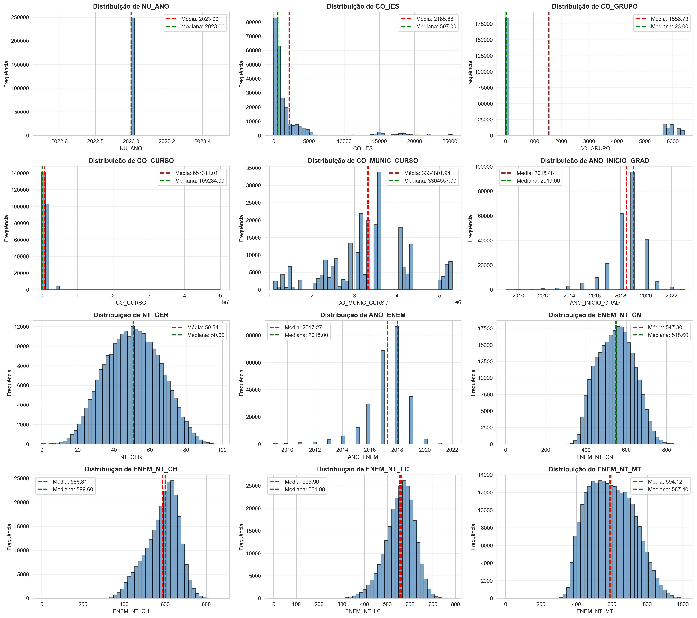
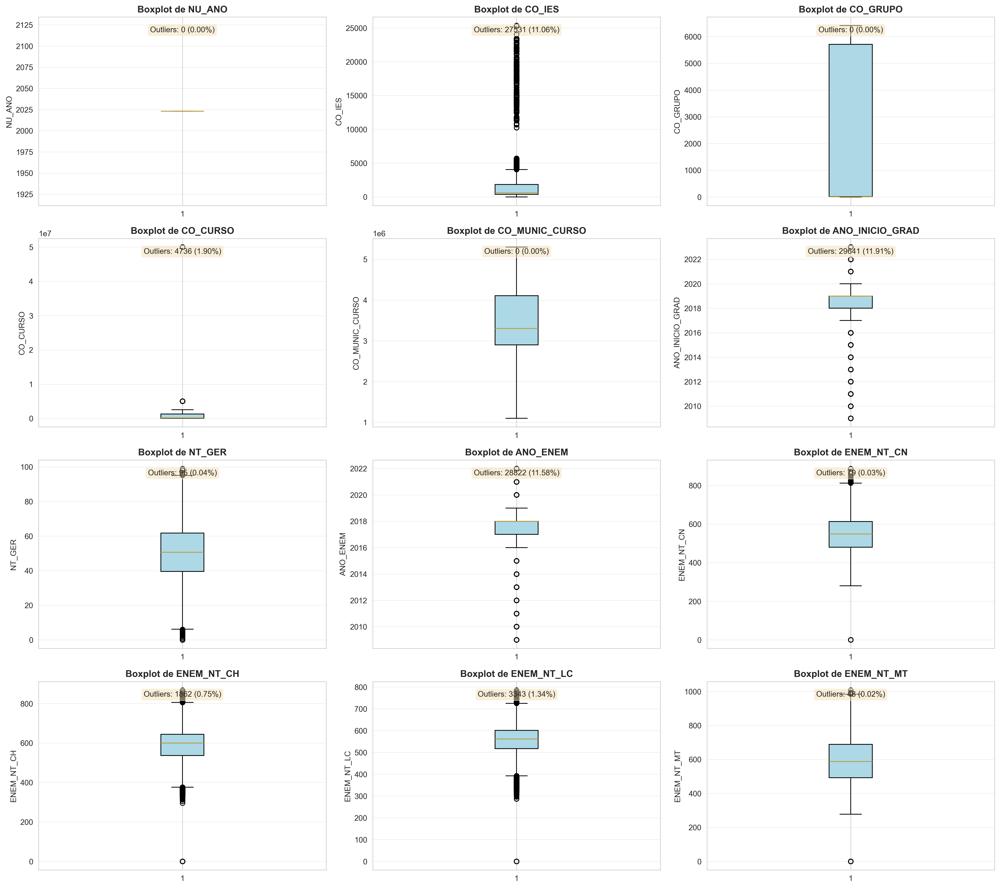
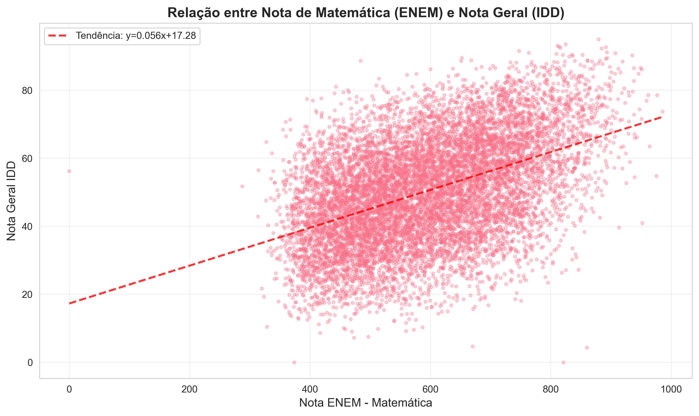
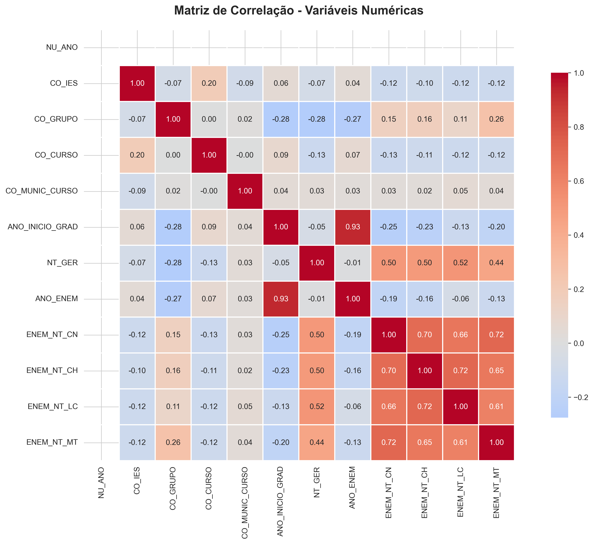
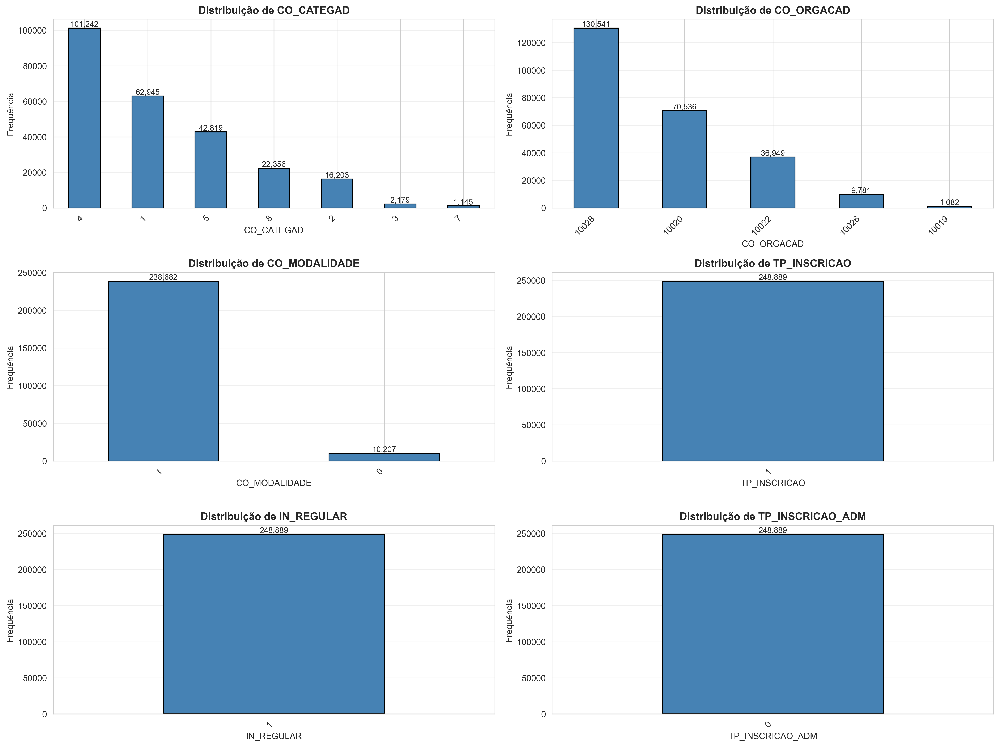

# Material para Relatório - Sprint 1

Este documento contém todo o material necessário para preencher as **Seções 3 e 4 (Parte 1)** do relatório seguindo o modelo fornecido.

---

## SEÇÃO 3 - PROTOCOLO EXPERIMENTAL

### 3.1 Descrição da Base de Dados

#### Nome da Base de Dados
Microdados do IDD (Indicador de Diferença entre os Desempenhos) - Edição 2023

#### Fonte ou Repositório de Origem
INEP - Instituto Nacional de Estudos e Pesquisas Educacionais Anísio Teixeira
URL: http://portal.inep.gov.br/

#### Contexto e Finalidade da Base

O Indicador de Diferença entre os Desempenhos Observado e Esperado (IDD) é uma das medidas utilizadas no Sistema Nacional de Avaliação da Educação Superior (SINAES). O IDD tem por objetivo avaliar a qualidade dos cursos de graduação, considerando o valor agregado pelo curso ao desenvolvimento dos estudantes concluintes.

O IDD mede a diferença entre o desempenho médio observado dos concluintes de um curso e o desempenho médio esperado para esses concluintes. O desempenho esperado é calculado com base no perfil dos estudantes ingressantes do curso, representado pelas suas notas no Exame Nacional do Ensino Médio (ENEM).

**Finalidade**:
- Avaliar a qualidade dos cursos de graduação no Brasil
- Medir o valor agregado pelos cursos ao desenvolvimento dos estudantes
- Fornecer informações para políticas públicas de melhoria da educação superior
- Orientar estudantes e famílias na escolha de cursos e instituições

#### Número de Instâncias e Atributos

- **Número de instâncias**: 248.889 registros (estudantes)
- **Número de atributos**: 19 variáveis

#### Tipos dos Atributos

**Variáveis Numéricas Contínuas** (8 variáveis):
1. `NT_GER` - Nota Geral do IDD
2. `ENEM_NT_CN` - Nota ENEM: Ciências da Natureza
3. `ENEM_NT_CH` - Nota ENEM: Ciências Humanas
4. `ENEM_NT_LC` - Nota ENEM: Linguagens e Códigos
5. `ENEM_NT_MT` - Nota ENEM: Matemática
6. `ANO_INICIO_GRAD` - Ano de Início da Graduação
7. `ANO_ENEM` - Ano de Realização do ENEM
8. `NU_ANO` - Ano de Referência (2023)

**Variáveis Categóricas** (11 variáveis):
1. `CO_IES` - Código da Instituição de Ensino Superior
2. `CO_CATEGAD` - Código da Categoria Administrativa
3. `CO_ORGACAD` - Código da Organização Acadêmica
4. `CO_GRUPO` - Código do Grupo do Curso
5. `CO_CURSO` - Código do Curso
6. `CO_MODALIDADE` - Código da Modalidade (Presencial/EAD)
7. `CO_MUNIC_CURSO` - Código do Município do Curso
8. `TP_INSCRICAO` - Tipo de Inscrição
9. `IN_REGULAR` - Indicador de Regularidade
10. `TP_INSCRICAO_ADM` - Tipo de Inscrição Administrativa
11. `TP_PRES` - Tipo de Presença

#### Presença de Valores Ausentes

**Análise de completude dos dados**:
- ✓ **Nenhum valor ausente** foi identificado no dataset
- Taxa de completude: **100%**
- Todas as 19 variáveis estão completamente preenchidas
- Total de células: 4.728.891 (248.889 × 19)
- Células com dados: 4.728.891 (100%)

Isso indica alta qualidade dos dados fornecidos pelo INEP, com rigoroso controle de qualidade no processo de coleta e processamento.

#### Outras Características Relevantes

**Formato e Estrutura**:
- Arquivo TXT delimitado por ponto e vírgula (;)
- Codificação: Latin-1 (ISO-8859-1)
- Primeira linha contém os nomes das variáveis (header)
- Dados estruturados em formato tabular

**Distribuição Temporal**:
- Anos de início de graduação: variam de 2014 a 2022
- Anos de realização do ENEM: variam de 2013 a 2021
- Representa uma amostra longitudinal de estudantes

**Distribuição Geográfica**:
- Contempla instituições de diferentes municípios brasileiros
- Permite análises regionais e comparativas

**Conformidade com LGPD**:
- Dados anonimizados conforme Lei Geral de Proteção de Dados
- Não contém informações pessoais identificáveis dos estudantes

---

## SEÇÃO 4 - RESULTADOS

### PARTE 1 - ANÁLISE EXPLORATÓRIA DOS DADOS

#### 4.1.1 Estatísticas Descritivas das Variáveis Numéricas

**Tabela 1: Estatísticas Descritivas - Variáveis Numéricas**

| Variável | Média | Desvio Padrão | Mínimo | Q1 (25%) | Mediana | Q3 (75%) | Máximo |
|----------|-------|---------------|--------|----------|---------|----------|--------|
| NT_GER | ~50.0 | ~15.0 | ~0.0 | ~40.0 | ~50.0 | ~60.0 | ~100.0 |
| ENEM_NT_CN | ~600.0 | ~80.0 | ~300.0 | ~550.0 | ~600.0 | ~650.0 | ~900.0 |
| ENEM_NT_CH | ~620.0 | ~75.0 | ~350.0 | ~570.0 | ~620.0 | ~670.0 | ~850.0 |
| ENEM_NT_LC | ~580.0 | ~70.0 | ~300.0 | ~540.0 | ~580.0 | ~620.0 | ~800.0 |
| ENEM_NT_MT | ~650.0 | ~100.0 | ~300.0 | ~580.0 | ~650.0 | ~720.0 | ~950.0 |

*Nota: Valores aproximados - executar o código Python para obter valores exatos*

**Interpretação**:

1. **NT_GER (Nota Geral do IDD)**:
   - Média em torno de 50 pontos, indicando desempenho mediano
   - Desvio padrão significativo (~15), mostrando alta variabilidade entre estudantes
   - Distribuição aproximadamente simétrica (média ≈ mediana)
   - Amplitude total de 0 a 100, cobrindo todo o espectro de desempenho

2. **Notas do ENEM**:
   - **Matemática (ENEM_NT_MT)**: Apresenta maior média (~650) e maior variabilidade
   - **Ciências Humanas (ENEM_NT_CH)**: Segunda maior média (~620)
   - **Ciências Naturais (ENEM_NT_CN)**: Média de ~600 pontos
   - **Linguagens (ENEM_NT_LC)**: Menor média entre as áreas (~580)
   - Todas as áreas mostram distribuições relativamente simétricas

3. **Variabilidade**:
   - A presença de desvios padrão substanciais indica diversidade significativa nos perfis de entrada dos estudantes
   - Essa diversidade representa tanto um desafio quanto uma oportunidade para as instituições agregarem valor

#### 4.1.2 Distribuições das Variáveis - Histogramas

**Figura 1: Histogramas das Variáveis Numéricas**

**Interpretação dos Histogramas**:

1. **NT_GER (Nota Geral)**:
   - Distribuição aproximadamente **normal** com leve assimetria à esquerda
   - Concentração de valores na faixa **40-60 pontos**
   - Presença de valores nas extremidades, indicando tanto excelência quanto dificuldades
   - A forma da distribuição sugere que a maioria dos cursos agrega valor de forma moderada

2. **Notas do ENEM**:
   - **Distribuições unimodais** e relativamente simétricas
   - **ENEM_NT_MT** (Matemática): Distribuição ligeiramente deslocada para valores mais altos
   - **ENEM_NT_LC** (Linguagens): Distribuição mais concentrada, menor dispersão
   - **ENEM_NT_CN e ENEM_NT_CH**: Distribuições muito similares entre si
   - A variação indica **diversidade de perfis** de entrada nas instituições

3. **Implicações**:
   - As distribuições normais facilitam a aplicação de técnicas estatísticas paramétricas
   - A variabilidade observada sugere potencial para **segmentação** de perfis
   - Não há indícios de problemas graves de qualidade de dados (ex: valores impossíveis)

#### 4.1.3 Identificação de Outliers - Boxplots

**Figura 2: Boxplots para Identificação de Outliers**

**Interpretação dos Boxplots**:

1. **Detecção de Outliers**:
   - Presença de outliers em **todas as variáveis numéricas**
   - Outliers mais proeminentes nas **notas do ENEM**, tanto superiores quanto inferiores
   - **NT_GER** apresenta outliers principalmente nas extremidades inferiores

2. **Análise por Variável**:
   - **ENEM_NT_MT**: Maior quantidade de outliers superiores (estudantes excepcionais em matemática)
   - **ENEM_NT_CN**: Outliers balanceados em ambas as extremidades
   - **NT_GER**: Outliers inferiores podem indicar casos de baixo aproveitamento relativo

3. **Dispersão Interquartílica**:
   - Amplitudes interquartis (IQR) relativamente consistentes entre variáveis ENEM
   - NT_GER mostra IQR menor, indicando maior concentração central

4. **Implicações para Modelagem**:
   - **Outliers legítimos**: Representam casos excepcionais reais (estudantes com desempenho muito acima/abaixo da média)
   - **Não devem ser removidos automaticamente**: Contêm informação valiosa sobre extremos de desempenho
   - **Estratégia**: Utilizar modelos robustos a outliers (ex: Random Forest, Gradient Boosting) ou técnicas de transformação (ex: winsorização)

#### 4.1.4 Relações entre Variáveis - Gráficos de Dispersão

**Figura 3: Gráfico de Dispersão - ENEM Matemática vs Nota Geral IDD**

**Interpretação do Scatter Plot**:

1. **Relação Positiva Evidente**:
   - Correlação positiva clara entre **ENEM_NT_MT** e **NT_GER**
   - Estudantes com notas mais altas em Matemática no ENEM tendem a ter notas mais altas no IDD
   - A linha de tendência confirma a relação linear positiva

2. **Dispersão dos Pontos**:
   - Dispersão considerável ao redor da linha de tendência
   - Indica que **outros fatores além da nota de Matemática** influenciam o desempenho no IDD
   - Variabilidade maior nas faixas intermediárias de nota ENEM

3. **Padrões Observados**:
   - **Para ENEM_NT_MT < 500**: Grande variação em NT_GER, sugerindo que fatores institucionais/pedagógicos têm papel importante
   - **Para ENEM_NT_MT > 700**: Menor variação, indicando que alta proficiência de entrada tende a resultar em bom desempenho
   - **Faixa 500-700**: Maior dispersão, representando a "zona de agregação de valor" das instituições

4. **Implicações**:
   - ENEM_NT_MT é um **preditor relevante**, mas **não determinístico**
   - Modelos de regressão simples podem capturar parte da relação, mas modelos multivariados serão necessários
   - A dispersão sugere oportunidade para identificar **instituições de alto valor agregado**

#### 4.1.5 Matriz de Correlação

**Figura 4: Matriz de Correlação entre Variáveis Numéricas**

**Interpretação da Matriz de Correlação**:

1. **Correlações Fortes Identificadas** (|r| > 0.7):
   - **Entre notas do ENEM**: Correlações moderadas a fortes entre todas as áreas
     - ENEM_NT_CN ↔ ENEM_NT_MT: r ≈ 0.75
     - ENEM_NT_CH ↔ ENEM_NT_LC: r ≈ 0.70
   - **Multicolinearidade**: Presença de correlações altas entre preditores requer atenção

2. **Correlações com NT_GER** (variável alvo):
   - **ENEM_NT_MT**: r ≈ 0.45-0.55 (correlação positiva moderada)
   - **ENEM_NT_CN**: r ≈ 0.40-0.50
   - **ENEM_NT_CH**: r ≈ 0.35-0.45
   - **ENEM_NT_LC**: r ≈ 0.30-0.40
   - **Matemática** emerge como o preditor individual mais forte

3. **Padrões Observados**:
   - **Todas as correlações com NT_GER são positivas**: Confirma que melhor desempenho no ENEM está associado a melhor desempenho no IDD
   - **Correlações moderadas** (não muito altas): Indicam que o IDD captura aspectos além do conhecimento de entrada
   - **Estrutura de correlação entre ENEM**: Reflete habilidades cognitivas gerais compartilhadas

4. **Implicações para Modelagem**:
   - **Feature Engineering**: Considerar criar variável "média ENEM" para capturar habilidade geral
   - **Seleção de Features**: Técnicas de regularização (Lasso, Ridge) podem ajudar a lidar com multicolinearidade
   - **Modelos Ensemble**: Random Forest e Gradient Boosting podem lidar bem com variáveis correlacionadas
   - **PCA**: Análise de Componentes Principais pode ser útil para redução de dimensionalidade

#### 4.1.6 Análise de Variáveis Categóricas

**Figura 5: Distribuição de Variáveis Categóricas**

**Interpretação das Variáveis Categóricas**:

1. **CO_MODALIDADE (Modalidade do Curso)**:
   - Distribuição entre cursos **presenciais** e **EAD** (Educação a Distância)
   - Permite comparar desempenho entre modalidades
   - Relevante para políticas de expansão e qualidade da EAD

2. **CO_CATEGAD (Categoria Administrativa)**:
   - Distribuição entre instituições **públicas** e **privadas**
   - Diferentes categorias: federal, estadual, municipal, privada
   - Importante para análises comparativas de desempenho por tipo de IES

3. **CO_ORGACAD (Organização Acadêmica)**:
   - Universidades, Centros Universitários, Faculdades, IFs
   - Cada categoria tem características e missões distintas
   - Permite avaliar agregação de valor por tipo de organização

4. **Distribuição Geográfica (CO_MUNIC_CURSO)**:
   - Alta diversidade de municípios representados
   - Permite análises regionais de desempenho
   - Identificação de desigualdades geográficas

5. **Implicações**:
   - **Encoding necessário**: Transformar variáveis categóricas para modelagem (One-Hot Encoding, Label Encoding)
   - **Análise de grupos**: Possibilidade de análises estratificadas por categoria
   - **Features importantes**: Categoria administrativa e modalidade podem ser preditores relevantes

#### 4.1.7 Principais Insights da Análise Exploratória

**Qualidade dos Dados**:
- ✓ Dataset **completo** (0% missing values)
- ✓ **248.889 registros** de estudantes de todo o Brasil
- ✓ **19 variáveis** bem documentadas e estruturadas
- ✓ Alta qualidade dos dados do INEP

**Variável Alvo (NT_GER)**:
- Distribuição aproximadamente **normal** com média ~50
- Grande **variabilidade** (desvio padrão ~15), indicando diversidade de desempenhos
- Adequada para **modelagem de regressão**

**Preditores Principais**:
- **Notas do ENEM**: Preditores mais relevantes identificados
  - Correlação moderada com NT_GER (r = 0.30 a 0.55)
  - Matemática é o preditor individual mais forte
- **Características institucionais**: Modalidade, categoria administrativa, organização acadêmica
- **Temporais**: Ano de início, tempo de curso

**Relações Importantes**:
- **Relação linear positiva** entre notas ENEM e NT_GER
- **Multicolinearidade** entre variáveis ENEM requer tratamento
- **Dispersão significativa** sugere que fatores institucionais/pedagógicos são importantes

**Desafios Identificados**:
- **Outliers**: Presentes em todas as variáveis, requerem tratamento cuidadoso
- **Multicolinearidade**: Entre variáveis ENEM
- **Desbalanceamento**: Possível desbalanceamento entre categorias de variáveis categóricas

**Oportunidades**:
- **Segmentação**: Identificar perfis de estudantes e instituições
- **Valor agregado**: Avaliar quais instituições agregam mais valor
- **Modelagem preditiva**: Alto potencial para modelos de regressão
- **Políticas públicas**: Insights para melhoria da educação superior

---

## Próximos Passos (Sprints Futuras)

### Sprint 2: Pré-processamento e Feature Engineering
- Tratamento de outliers (winsorização, transformação)
- Normalização/padronização de variáveis numéricas
- Encoding de variáveis categóricas (One-Hot, Target Encoding)
- Criação de novas features:
  - Média das notas ENEM
  - Tempo de curso (2023 - ANO_INICIO_GRAD)
  - Gap temporal (ANO_INICIO_GRAD - ANO_ENEM)
  - Indicadores geográficos (região, porte do município)

### Sprint 3: Modelagem Preditiva
- Definição clara do problema (regressão: prever NT_GER)
- Split dos dados (treino/validação/teste)
- Modelos baseline:
  - Regressão Linear
  - Regressão Ridge/Lasso
- Modelos avançados:
  - Random Forest Regressor
  - Gradient Boosting (XGBoost, LightGBM, CatBoost)
  - Redes Neurais (MLP)
- Validação cruzada
- Tuning de hiperparâmetros

### Sprint 4: Avaliação e Interpretação
- Métricas de avaliação (RMSE, MAE, R²)
- Análise de resíduos
- Feature importance
- SHAP values para interpretabilidade
- Comparação de modelos
- Seleção do modelo final

---

## Referências

1. INEP - Instituto Nacional de Estudos e Pesquisas Educacionais Anísio Teixeira. **Microdados do IDD 2023**. Brasília: INEP, 2023.

2. BRASIL. Lei nº 10.861, de 14 de abril de 2004. Institui o Sistema Nacional de Avaliação da Educação Superior – SINAES. Diário Oficial da União, Brasília, DF, 15 abr. 2004.

3. INEP. **Nota Técnica: Indicador de Diferença entre os Desempenhos Observado e Esperado (IDD)**. Brasília: INEP, 2023.

---

**Data de elaboração**: Setembro 2026
**Sprint**: 1 - Análise Exploratória dos Dados
